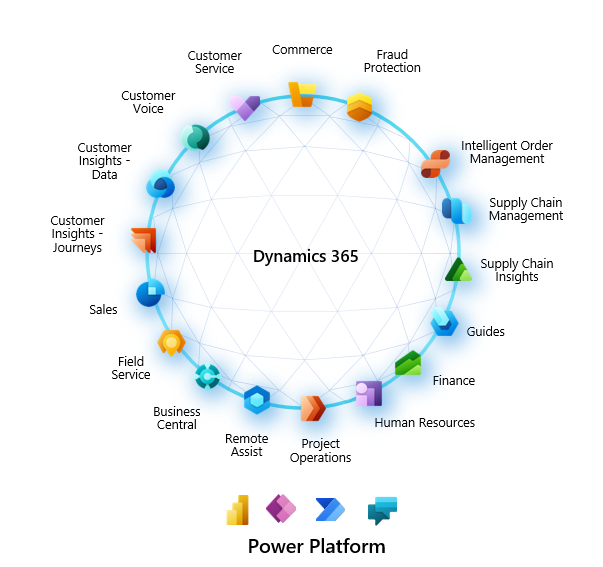

# 第一章：Dynamics 365 F\&O入门


本节为大家介绍D365 F\&O的组成和内容，目的是让大家快速了解F\&O的核心模块和能力


Dynamics 365 应用程序，企业可以：

* **吸引客户并建立关系** - 重新构想与客户之间的互动，通过使用数据和智能来创造个性化的市场营销、销售和服务体验，从而改进每次互动。
* **优化运营**- 在整个业务流程中融入智能和规范化指导，从而改进服务、提高效率和降低成本。
* **为员工提供支持**- 利用工作区中提供的数据和见解雇用和吸引优秀人才，并促使其发挥最大潜力。
* **革新产品和服务** - 将数据作为战略资产使用，以发现新的市场商机、生产创新产品，以及通过全面了解客户和运营来创造卓越的客户体验。

Dynamics 365 是指一系列商业应用程序，涵盖广泛的业务领域。 这些解决方案有时称为业务线应用程序或 LOB 解决方案。 在过去，Dynamics 365 应用分为两类：客户活动应用程序和企业资源规划 (ERP) 应用程序。 但是，随着 Microsoft Business Applications、Dynamics 365 和 Microsoft Power Platform 应用程序的发展，这些业务线之间的界线已变得模糊，越来越趋向一个整体。 这些选项还包括 Dynamics 365 与 Microsoft Modern Workplace (Microsoft 365) 产品、LinkedIn、Microsoft Power BI、Microsoft Dynamics 365 Business Central 和其他 Microsoft 应用程序的集成。

<figure><figcaption></figcaption></figure>

本文重点为大家介绍Microsoft Dynamics 365 ERP，并用于组织内的多个日常运营。 这些应用负责处理库存、购买和销售商品以及跟踪所有财务内容等任务。 当客户互动应用专注于处理客户互动时，下面的四个应用涵盖企业的日常运营。 此列表并未列出所有相关应用，但以下列出的几项都是得到广泛使用的代表性应用。

* **Dynamics 365 Finance**- 帮助您实现全局财务运营的自动化和现代化。 您可以实时监视绩效，预测未来结果，并做出数据驱动决策以推动业务增长。 使用 Finance 通过 AI 推动战略财务决策，统一并自动执行您的财务流程，减少运营费用，降低全局财务复杂性和风险。
* **Dynamics 365 Supply Chain Management**- 帮助您实现制造和供应链运营转型。 在计划、生产、库存、仓库和运输管理中使用 AI 和物联网 (IoT) 的预测见解和智能。 Supply Chain Management 可以最大化运营效率、产品质量和盈利能力。 使用 Supply Chain Management 通过智能制造运营进行创新，实现仓库管理现代化，优化生产绩效，最大限度地延长资产寿命，并实现供应链的自动化和简化。
* **Dynamics 365 Human Resources**- 简化许多记录保留任务并实现多个人员配备流程的自动化。 这些流程包括员工挽留、福利管理、培训、绩效评审和变更管理。 Human Resources 还提供了一个框架，供人力资源员工管理监督领域。
* **Dynamics 365 Commerce**- 提供统一后端办公系统、店内、呼叫中心和数字体验的综合性全渠道解决方案。 Commerce 支持您通过个性化的客户互动来建立品牌忠诚度，通过提高员工工作效率来增加收入，优化运营以降低成本，以及提高供应链效率。

## Microsoft Power Platform 

\
